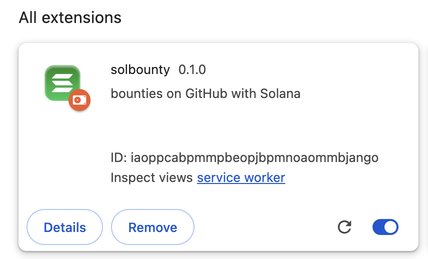

# Solbounty Browser Extension

### Installation and Usage

1. Run `npm install`
2. Run `npm run build`
3. Go to `chrome://extensions/` in your browser
4. Enable Developer Mode
5. Click on `Load Unpacked`
6. Select the `dist` folder
7. Reload the extension if required
8. The extension should now be installed

